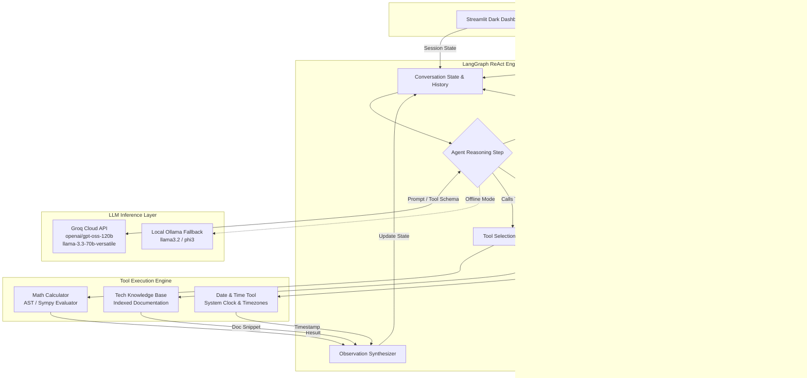

<div align="center">

# Multi-Tool AI Agent

**Autonomous ReAct Agent powered by Groq LPU Inference, LangChain, and LangGraph**

[](https://multi-t-agent.streamlit.app/)
[](https://www.python.org/downloads/)
[](https://python.langchain.com/)
[](https://langchain-ai.github.io/langgraph/)
[](https://groq.com/)
[](LICENSE)

<br/>

**Live Deployment:** [https://multi-t-agent.streamlit.app/](https://multi-t-agent.streamlit.app/)

<br/>

<!-- Dashboard Screenshot -->
<p align="center">
  
</p>

*Minimal editorial dashboard featuring thread management, session persistence, and real-time tool calling.*

</div>

---

## Overview

Multi-Tool AI Agent is an end-to-end intelligent assistant built with LangChain, LangGraph, and Groq Cloud API (with local Ollama fallback). The system implements an autonomous ReAct (Reasoning + Acting) execution cycle, enabling the language model to analyze user queries, dynamically select and invoke deterministic tools, evaluate observations, and synthesize precise responses.

### Key Capabilities
- **Streamlit Dashboard**: Dark editorial interface with thread history, automated chat labeling, and conversational memory.
- **FastAPI REST Backend**: Asynchronous endpoints supporting multi-session persistence, health monitoring, and tool inspection.
- **React Frontend**: Vite-powered client interface for headless integration.
- **CLI Workflows**: Terminal runners with memory inspection and compiled LangGraph execution graphs.

---

## System Architecture

The diagram below outlines the system data flow across the client interfaces, API orchestration layer, LangGraph ReAct engine, LLM inference provider, and tool execution layer.



### Execution Pipeline
1. **User Request**: The user submits a prompt via the Streamlit interface, React frontend, or API endpoint.
2. **Context Compilation**: Previous conversation history is retrieved from the session store and formatted as structured LangChain message objects.
3. **Reasoning Step**: The agent evaluates the prompt against registered tool definitions using Groq inference.
4. **Tool Execution**: If a calculation, documentation lookup, or current timestamp is required, the matching tool executes in an isolated environment.
5. **Observation & Synthesis**: The execution result is fed back into the agent loop to generate the final response.

---

## Built-in Tools

| Tool | Functionality | Example Queries |
| :--- | :--- | :--- |
| **Calculator** | Evaluates mathematical expressions, powers, and roots | `sqrt(144) + 25*3`, `2**16 - 1024` |
| **Knowledge Base** | Retrieves technical documentation for libraries and frameworks | `What is LangGraph?`, `Explain ReAct prompting` |
| **Date and Time** | Returns current calendar date, timestamps, and system time | `What day is it today?`, `Current UTC time` |

---

## Project Structure

```text
Multi-Tool-LLM-Agent/
├── assets/
│   └── dashboard.png             # UI preview screenshot
├── backend/
│   └── api.py                    # FastAPI server with session & tool endpoints
├── frontend/
│   ├── src/                      # React frontend components and views
│   └── package.json              # Frontend dependencies
├── tools/
│   ├── calculator.py             # Math expression evaluator
│   ├── datetime_tool.py          # Real-time clock and calendar utility
│   └── knowledge_base.py         # Technical documentation lookup
├── tests/
│   └── test_tools.py             # Pytest suite for tool verification
├── .streamlit/
│   └── config.toml               # Streamlit theme and server configuration
├── .env.example                  # Environment variable template
├── agent.py                      # Basic CLI agent runner
├── agent_langgraph.py            # LangGraph ReAct workflow runner
├── agent_with_memory.py          # Memory-enabled conversational runner
├── app.py                        # Streamlit dark editorial dashboard
├── config.py                     # Centralized configuration and secrets loader
├── requirements.txt              # Production Python dependencies
└── setup.py                      # Environment and dependency verification script
```

---

## Quickstart

### 1. Prerequisites
- Python 3.10 or higher
- [Groq API Key](https://console.groq.com/keys) (Free tier available)
- *(Optional)* [Ollama](https://ollama.com/) for local offline fallback

### 2. Installation
```bash
git clone https://github.com/syedaftab-dev/Multi-Tool-LLM-Agent.git
cd Multi-Tool-LLM-Agent

# Create and activate virtual environment
python -m venv venv
# On Windows:
.\venv\Scripts\activate
# On Linux/macOS:
source venv/bin/activate

# Install dependencies
pip install -r requirements.txt
```

### 3. Environment Configuration
Copy `.env.example` to `.env`:
```bash
cp .env.example .env
```

Configure your credentials in `.env`:
```env
# Provider: "groq" (recommended) or "ollama"
LLM_PROVIDER=groq

# Groq Configuration
GROQ_API_KEY=gsk_your_actual_groq_api_key_here
GROQ_MODEL=openai/gpt-oss-120b

# Optional Local Fallback
OLLAMA_MODEL=phi3
OLLAMA_BASE_URL=http://localhost:11434

# Hyperparameters
TEMPERATURE=0.1
MAX_TOKENS=1024
```

### 4. Verification
Run the setup check script to ensure all dependencies and API keys are properly configured:
```bash
python setup.py
```

---

## Running Applications

### Streamlit Dashboard
```bash
streamlit run app.py
```
Access the application locally at `http://localhost:8501` or visit the live deployment at [multi-t-agent.streamlit.app](https://multi-t-agent.streamlit.app/).

### FastAPI REST Server
```bash
uvicorn backend.api:app --reload --port 8000
```
Interactive OpenAPI documentation will be accessible at `http://localhost:8000/docs`.

### React Frontend
```bash
cd frontend
npm install
npm run dev
```

### Command Line Runners
```bash
# Basic agent execution
python agent.py

# Conversational CLI with memory
python agent_with_memory.py

# Compiled LangGraph state machine
python agent_langgraph.py
```

---

## Testing

Execute the unit test suite:
```bash
python -m pytest tests -v
```

---

## Deployment

The application is deployed on **Streamlit Community Cloud**:
- **Live URL**: [https://multi-t-agent.streamlit.app/](https://multi-t-agent.streamlit.app/)

### Deploying Your Own Instance
1. Fork or push this repository to GitHub.
2. Sign in to [share.streamlit.io](https://share.streamlit.io/) and create a **New app**.
3. Select your repository, branch `main`, and main file `app.py`.
4. In **Advanced settings... -> Secrets**, configure:
   ```toml
   LLM_PROVIDER = "groq"
   GROQ_API_KEY = "gsk_your_groq_api_key_here"
   GROQ_MODEL = "openai/gpt-oss-120b"
   ```
5. Click **Deploy**.

---

## License

This project is licensed under the MIT License. See [LICENSE](LICENSE) for details.
