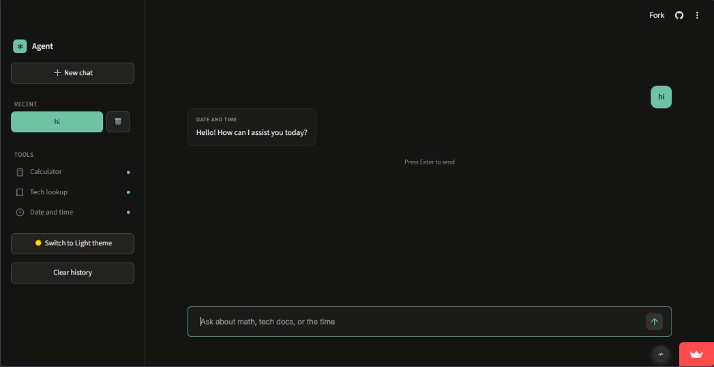
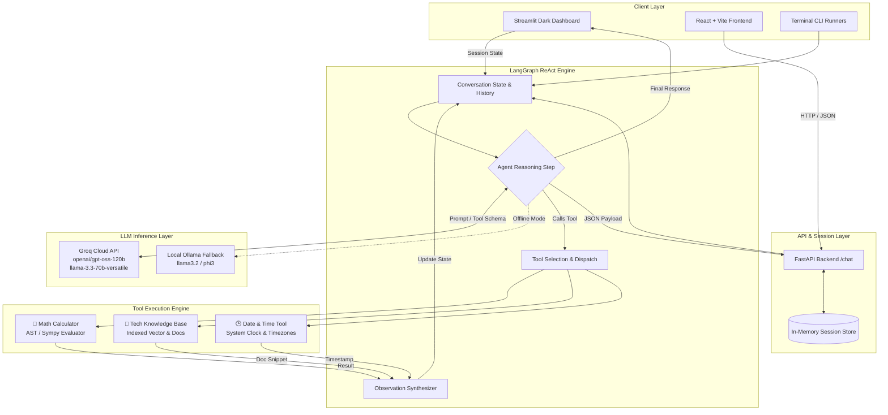

<div align="center">

# ⚡ Multi-Tool AI Agent

**Autonomous ReAct Agent powered by Groq LPU Inference, LangChain & LangGraph**

[](https://www.python.org/downloads/)
[](https://python.langchain.com/)
[](https://langchain-ai.github.io/langgraph/)
[](https://groq.com/)
[](https://streamlit.io/)
[](https://fastapi.tiangolo.com/)
[](LICENSE)

<br/>

<!-- Dashboard Screenshot -->
<p align="center">
  
</p>

*Modern ChatGPT-style dark editorial dashboard with sidebar session management, real-time tool calling, and sub-second Groq responses.*

</div>

---

## 📌 Overview

**Multi-Tool AI Agent** is an end-to-end intelligent assistant built with **LangChain**, **LangGraph**, and **Groq Cloud API** (with offline **Ollama** fallback). The system implements an autonomous **ReAct (Reasoning + Acting)** loop, allowing the LLM to inspect user queries, dynamically select and execute Python tools, evaluate execution outputs, and synthesize accurate responses.

The application includes:
- **Editorial Streamlit Dashboard**: A minimalist, dark-themed UI featuring conversation threads, title generation, chat deletion, and suggestions.
- **REST API Backend**: FastAPI service supporting asynchronous streaming, session history, and tool metadata endpoints.
- **Modern React Frontend**: Clean Vite + React client for headless integrations.
- **Command Line Interfaces**: Terminal runners with CLI memory inspection and LangGraph workflow visualization.

---

## 🏛️ System Architecture

The following diagram illustrates the flow of execution from the client layer through the LangGraph ReAct agent orchestration to the tool execution and LLM inference engine:



### Workflow Execution Details:
1. **User Request**: The user submits a query through the Streamlit interface or API.
2. **Context Compilation**: Previous conversation history is retrieved from session state and formatted as LangChain `HumanMessage` and `AIMessage` objects.
3. **Reasoning & Tool Call**: The agent invokes Groq's high-speed inference engine equipped with tool schemas.
4. **Tool Execution**: If a calculation, technical documentation lookup, or current time is needed, the respective Python tool executes safely in an isolated environment.
5. **Observation & Synthesis**: The tool's output is injected into the agent scratchpad, producing a verified final response.

---

## 🛠️ Built-in Tools

| Tool | Capability | Example Queries |
| :--- | :--- | :--- |
| **🧮 Calculator** | Evaluates mathematical expressions, powers, roots, and equations | `"sqrt(144) + 25*3"`, `"2**16 - 1024"` |
| **📖 Knowledge Base** | Retrieves documentation for frameworks, architectures, and libraries | `"What is LangGraph?"`, `"Explain ReAct prompting"` |
| **🕒 Date & Time** | Fetches the current system time, calendar date, and timestamps | `"What day is it today?"`, `"Current UTC time"` |

---

## 📁 Repository Structure

```text
Multi-Tool-LLM-Agent/
├── assets/
│   └── dashboard.png             # UI preview screenshot
├── backend/
│   └── api.py                    # FastAPI server with session & tool endpoints
├── frontend/
│   ├── src/                      # React frontend components and views
│   └── package.json              # Frontend dependencies
├── tools/
│   ├── calculator.py             # Math expression evaluator
│   ├── datetime_tool.py          # Real-time clock and calendar utility
│   └── knowledge_base.py         # Technical documentation lookup
├── tests/
│   └── test_tools.py             # Pytest suite for tool verification
├── .streamlit/
│   └── config.toml               # Streamlit theme and server configuration
├── .env.example                  # Environment template
├── agent.py                      # Basic CLI agent
├── agent_langgraph.py            # LangGraph ReAct workflow runner
├── agent_with_memory.py          # Memory-enabled CLI runner
├── app.py                        # Streamlit dark editorial dashboard
├── config.py                     # Centralized environment & secrets loader
├── requirements.txt              # Python production dependencies
└── setup.py                      # Environment & dependency verification script
```

---

## 🚀 Quickstart Guide

### 1. Prerequisites
- Python 3.10 or higher
- [Groq API Key](https://console.groq.com/keys) (Free tier available)
- *(Optional)* [Ollama](https://ollama.com/) if running fully local models

### 2. Clone and Install
```bash
git clone https://github.com/syedaftab-dev/Multi-Tool-LLM-Agent.git
cd Multi-Tool-LLM-Agent

# Create and activate virtual environment
python -m venv venv
# On Windows:
.\venv\Scripts\activate
# On Linux/macOS:
source venv/bin/activate

# Install dependencies
pip install -r requirements.txt
```

### 3. Configure Environment Variables
Copy `.env.example` to `.env`:
```bash
cp .env.example .env
```
Update `.env` with your API credentials:
```env
# Provider: "groq" (recommended) or "ollama"
LLM_PROVIDER=groq

# Groq Configuration
GROQ_API_KEY=gsk_your_actual_groq_api_key_here
GROQ_MODEL=openai/gpt-oss-120b

# Optional Local Fallback
OLLAMA_MODEL=phi3
OLLAMA_BASE_URL=http://localhost:11434

# Hyperparameters
TEMPERATURE=0.1
MAX_TOKENS=1024
```

### 4. Verify Installation
Run the automated environment check:
```bash
python setup.py
```

---

## 💻 Running the Interfaces

### 🌟 Streamlit Dashboard (Recommended)
Launch the dark-themed editorial chat UI:
```bash
streamlit run app.py
```
Open your browser at `http://localhost:8501`.

### ⚡ FastAPI Backend
Run the high-performance REST API:
```bash
uvicorn backend.api:app --reload --port 8000
```
Interactive Swagger docs will be available at `http://localhost:8000/docs`.

**Key Endpoints:**
- `GET /health` — Service health and active LLM provider info
- `GET /tools` — List registered tools and signatures
- `POST /chat` — Send a message within a session
- `GET /sessions` — List active sessions
- `DELETE /sessions/{session_id}` — Clear a session

### ⚛️ React + Vite Frontend
```bash
cd frontend
npm install
npm run dev
```

### 🖥️ CLI Agent
```bash
# Basic tool calling
python agent.py

# Memory-enabled conversational CLI
python agent_with_memory.py

# LangGraph compiled state graph
python agent_langgraph.py
```

---

## 🧪 Testing

Run automated unit tests to verify tool accuracy:
```bash
python -m pytest tests -v
```

---

## ☁️ Deployment

### Streamlit Community Cloud (1-Click Free Deploy)
1. Fork or push this repository to your GitHub account.
2. Visit [share.streamlit.io](https://share.streamlit.io/) and select **New app**.
3. Choose repository `syedaftab-dev/Multi-Tool-LLM-Agent`, branch `main`, and main file `app.py`.
4. Under **Advanced settings... -> Secrets**, add:
   ```toml
   LLM_PROVIDER = "groq"
   GROQ_API_KEY = "gsk_your_groq_api_key_here"
   GROQ_MODEL = "openai/gpt-oss-120b"
   ```
5. Click **Deploy!**

---

## 📄 License

This project is licensed under the MIT License — see the [LICENSE](LICENSE) file for details.
