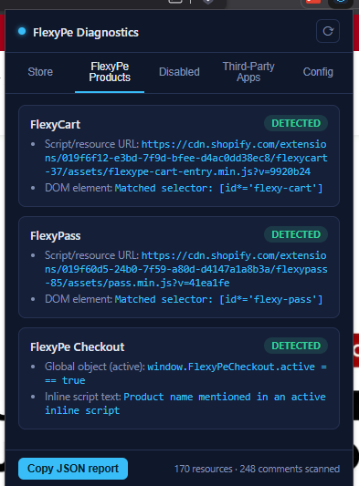
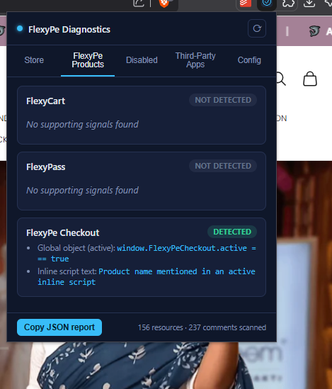

# 🔍 FlexyPe Store Diagnostics — Chrome Extension

A lightweight, high-precision Manifest V3 Chrome extension designed for **FlexyPe Sales & Support teams**. In a single click, it scans any live Shopify storefront to instantly extract store metadata, identify active FlexyPe integrations, highlight disabled/commented-out widgets, and index third-party Shopify apps — all directly inside the browser popup with zero backend dependency.

---

## 📸 Test Results & Proof of Concept

Below are real diagnostic scans performed live on the target Shopify storefronts:

### 1. `zouraofficial.com` — Multi-Product Detection
> **Result**: Successfully detected **FlexyCart**, **FlexyPass**, and **FlexyPe Checkout** operating on the storefront via live DOM selectors, resource CDN links, and global objects.



---

### 2. `aseemshakti.com` — Storefront Audit
> **Result**: Successfully detected active **FlexyPe Checkout** via global `window.FlexyPeCheckout.active === true` state and inline scripts, while accurately reporting FlexyCart and FlexyPass as **Not Detected**.



---

## 🚀 Quick Setup & Installation

1. Clone or download this repository.
2. Open Google Chrome and navigate to `chrome://extensions`.
3. Enable **Developer mode** via the top-right toggle switch.
4. Click **Load unpacked** and select the `flexype-store-diagnostics` project directory.
5. Pin the extension to your toolbar, open any Shopify storefront, and click the FlexyPe icon to trigger an instant diagnostic scan.

---

## 🛠️ Architecture & Data Flow

```
popup.js (Orchestrator - Extension Popup Context)
   │
   ├──> chrome.scripting.executeScript(world: "MAIN")
   │       Injects collector.js directly into the storefront's MAIN execution world
   │
   ├──> collector.js → collectPageSignals()
   │       Reads window.Shopify, active JS globals, script resource URLs, 
   │       DOM elements, and parses HTML comments live in page context
   │
   ├──> detection.js → runDetection()
   │       Scores raw signals against confidence thresholds
   │
   └──> config.js
           Centralized signature config & rule patterns (CDNs, DOM selectors, global vars)
```

> **Why `world: "MAIN"`?**  
> Standard Chrome content scripts operate in an isolated JavaScript environment unable to read real page-level `window` variables. Using `world: "MAIN"` allows `collector.js` to directly inspect live globals like `window.Shopify` and `window.FlexyPeCheckout`.

---

## 📊 Detection Scoring & Confidence Tiers

Every product is evaluated across multiple signal layers. Points accumulate to determine an objective confidence classification:

| Signal Type | Point Weight | Rationale & Evidence Strength |
| :--- | :---: | :--- |
| **Active Global Variable** (`window.FlexyPe*`) | **40** | **Strongest**: Code from the integration has initialized in page memory. |
| **Script / Resource URL Match** | **30** | **Strong**: Vendor script loaded (`performance.getEntriesByType('resource')`). |
| **DOM Selector Match** | **25** | **Medium**: Active widget container or target root exists in the live DOM. |
| **Platform CDN Host Match** | **15** | **Weak/Supporting**: Generic FlexyPe CDN host found in resource inventory. |
| **Inline Script Mention** | **10** | **Weak**: Text mention found inside inline page scripts. |

### Classification Tiers:
- 🟢 **Detected** ($\ge 40$ points): Confirmed live integration (e.g., active global or script + DOM match).
- 🟡 **Likely** ($15 - 39$ points): Installed or partially configured, but lacking primary active signals.
- ⚪ **Not Detected** ($< 15$ points): No reliable signals found on the inspected page.

---

## 🔍 Part-by-Part Technical Capabilities

### Part 1: Store Information Extraction
Extracts core store metadata without making external API calls:
- Store URL, primary Shopify domain, and storefront name.
- Currency, country region, storefront language/locale.
- Active theme name and numeric Theme ID.
- Page type classifier (`Home`, `Product`, `Collection`, `Cart`, `Checkout`).

### Part 2: FlexyPe Product Detection
Scans for core FlexyPe product signatures:
- **FlexyPe Checkout**: Checks global `window.FlexyPeCheckout.active`, CDN scripts, and root DOM elements.
- **FlexyCart**: Scans for `flexype-cart-entry.min.js`, `flexype-cart-app.min.js`, and `#flexycart-root`.
- **FlexyPass**: Detects `pass.min.js` resource entries and `.flexypass-widget` selectors.

### Part 3: Disabled & Commented Integrations
Differentiates between absent vs. disabled integrations:
- Parses `window.FlexyPe*.active === false` flags.
- Executes a `TreeWalker` over `NodeFilter.SHOW_COMMENT` nodes to catch commented HTML tags.
- Inspects matched DOM elements for `display: none`, `visibility: hidden`, or `[hidden]` styling.

### Part 4: Third-Party Shopify App Indexing
Matches loaded resource URLs against a built-in database of popular Shopify apps (e.g., *Klaviyo*, *Yotpo*, *Recharge*, *Gorgias*, *PageFly*, *Loox*, *Privy*, *Smile.io*).

---

## 📁 Repository Structure

```
flexype-store-diagnostics/
├── assets/
│   ├── zouraofficial-test.png   # Screenshot proof for zouraofficial.com
│   └── aseemshakti-test.png     # Screenshot proof for aseemshakti.com
├── icons/
│   ├── icon16.png              # Toolbar icon (16x16)
│   ├── icon48.png              # Extension management icon (48x48)
│   └── icon128.png             # Chrome Web Store icon (128x128)
├── popup/
│   ├── popup.html              # Extension UI markup & tab system
│   ├── popup.css               # Dark-themed modern UI styles
│   ├── popup.js                # Extension popup controller & JSON export logic
│   ├── collector.js            # Injected script running in MAIN page world
│   ├── detection.js            # Pure scoring & confidence engine
│   └── config.js               # Signal patterns & third-party app signatures
├── .gitignore                  # Git exclusion rules
├── manifest.json               # Chrome Extension Manifest V3 configuration
└── README.md                   # Project documentation
```
